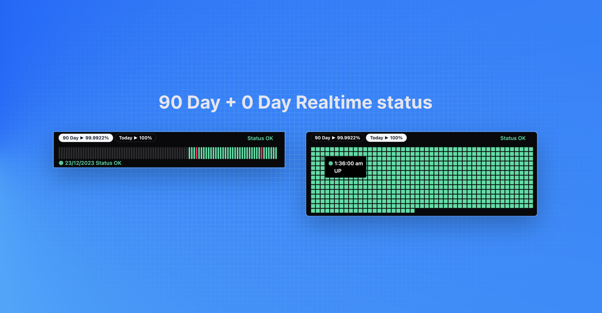
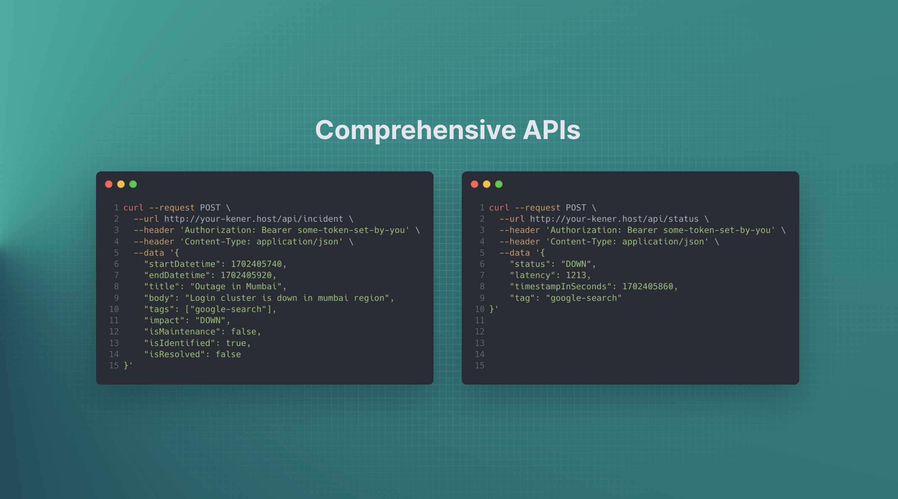
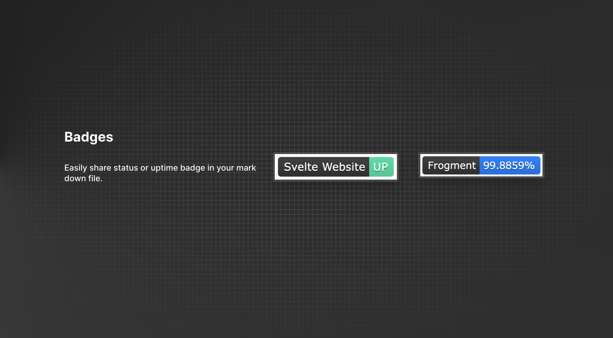
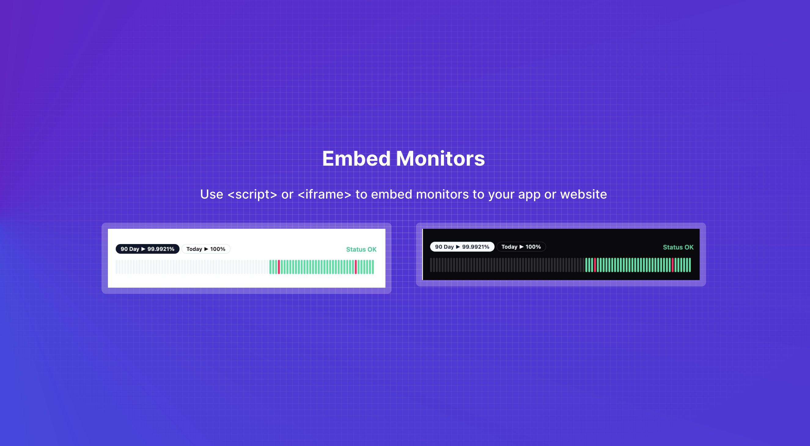
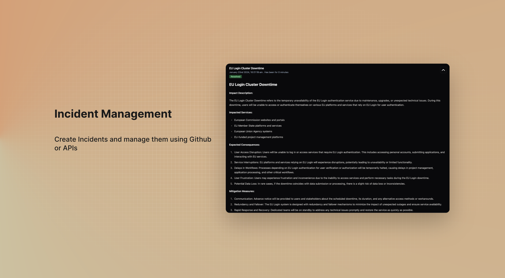
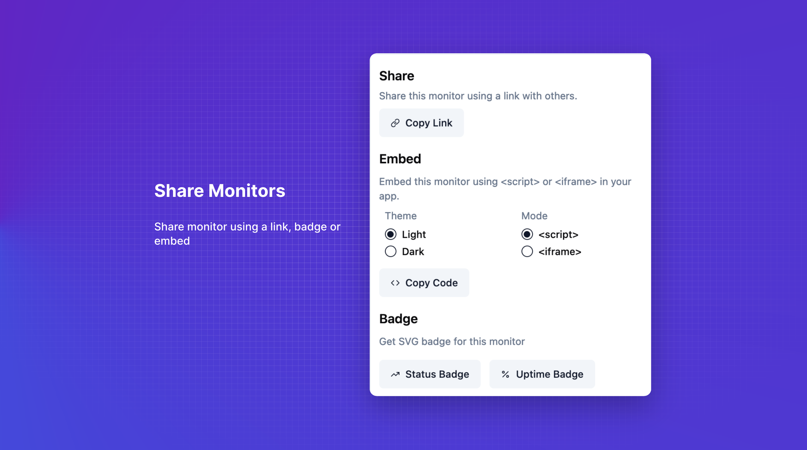
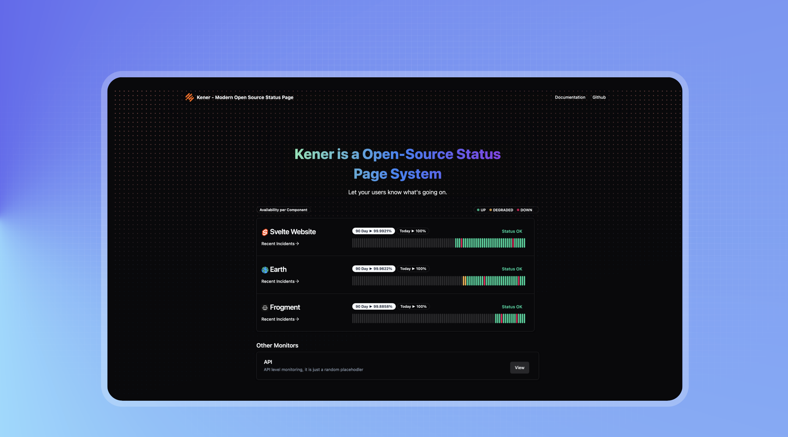
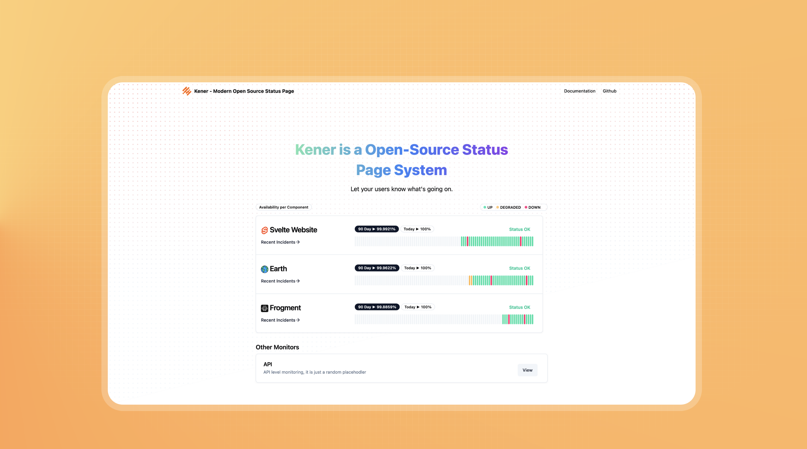
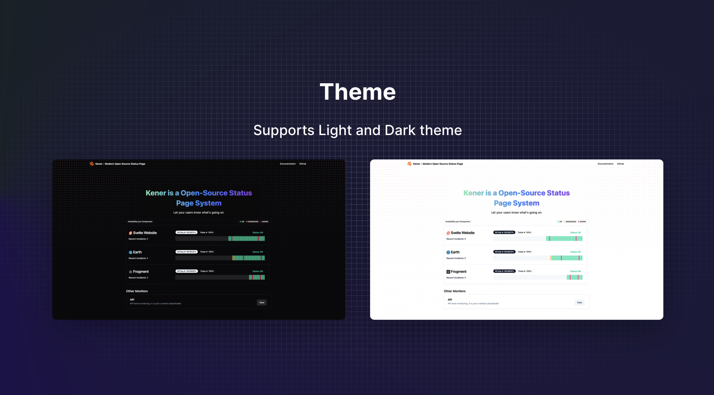

	

 

	
	

#### 👉 Visit a live server [here](https://kener.ing)

#### 👉 Read the documentation [here](https://kener.ing/docs) 

# Kener - Status Page System
Kener: Open-source Node.js status page tool, designed to make service monitoring and incident handling a breeze. It offers a sleek and user-friendly interface that simplifies tracking service outages and improves how we communicate during incidents. And the best part? Kener integrates seamlessly with GitHub, making incident management a team effort—making it easier for us to track and fix issues together in a collaborative and friendly environment.

It uses files to store the data. Other adapters are coming soon
  

## Features

- Real-time monitoring
- Handles Timezones without you knowing it
- Customizable status page
- 100% Accessiblty Score
- Easy installation and setup
- Automated incident management
- GitHub integration for issue tracking
- Environment variable configuration
- Production and custom deployment options
- API for status updates
- Badge generation for status and uptime display + Customization
- Support for custom domains
- Embed as an iframe or widget
- Categories for monitors
- Branding and theme (light + dark) customization
- Flexible monitor configuration using YAML
- Cron-based scheduling for monitors
- Secrets management for headers and bodies
- Evaluators for HTTP response parsing
- Incident tagging and labeling
- User-friendly interface
- Support for light and dark themes
- Responsive design for various devices
- Auto SEO and Social Media ready

## Technologies used
- [SvelteKit](https://kit.svelte.dev/)
- [shadcn-svelte](https://www.shadcn-svelte.com/)

## Inspired from 
- [Upptime](https://upptime.js.org/)

## Roadmap
- [ ] Add notification
- [x] Add api to create incident
- [ ] Add Mysql adapter

## Screenshots



 

## Support

